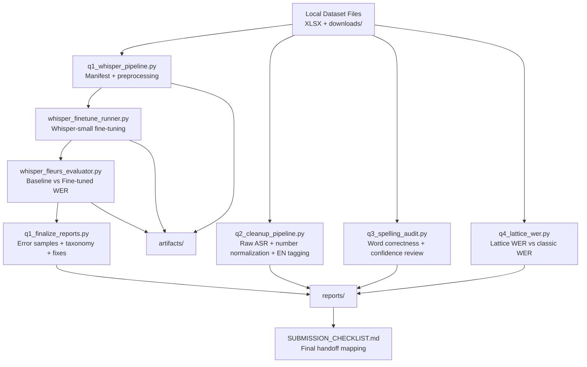

# System Architecture

## Notes
- `reports/` contains submission-ready outputs.
- `artifacts/` stores training manifests, predictions, and checkpoints.
- Q1 is the heaviest path (fine-tune + FLEURS evaluation).
